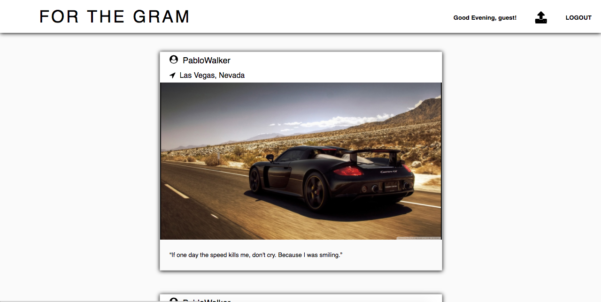
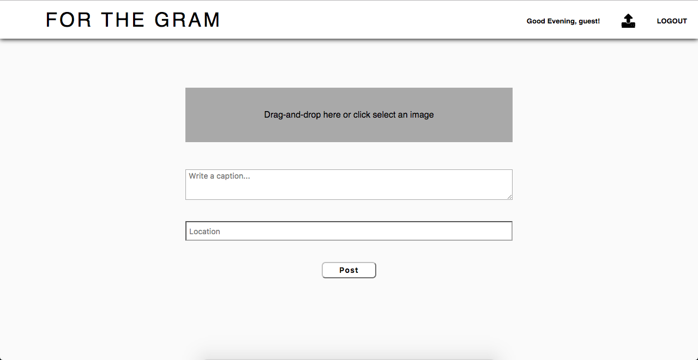
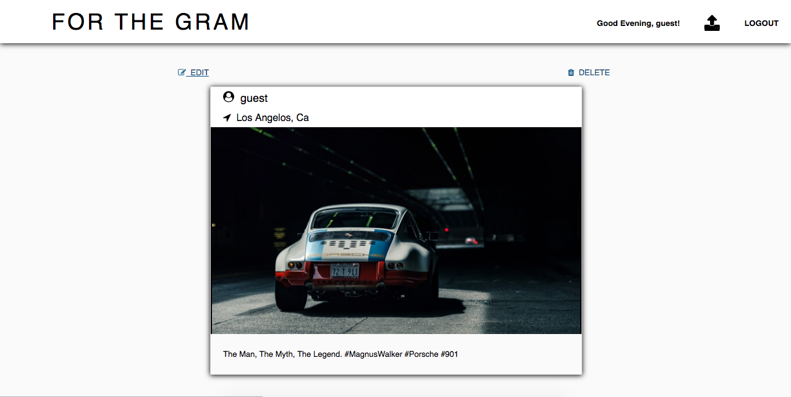
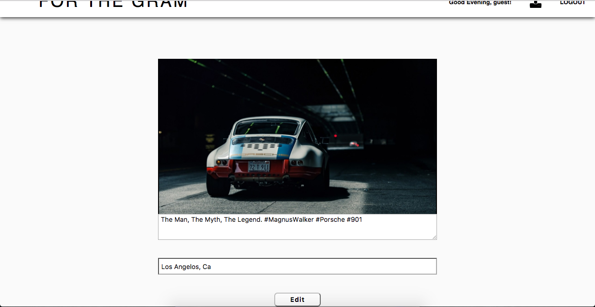

For the Gram

[LIVE] (https://forthegram.herokuapp.com/)

####This For the Gram is a web application based off of the popular social media website Instagram.
####This For the Gram runs on a Rails backend with a React front end.



##Features
For the Gram allows for user signup and login including a guest login to quickly checkout the site.<br>


For the Gram allows users to post pictures with a caption and location.<br>


For the Gram allows for users to delete their own pictures.<br>


For the Gram allows users to edit their existing posts.



##Implementation

For the Gram keeps your password safe.
```javascript
def is_password?(password)
  BCrypt::Password.new(self.password_digest).is_password?(password)
end

def password=(password)
  self.password_digest = BCrypt::Password.create(password)
  @password = password
end
```

For the Gram will allow users to edit and delete only their own post.
```javascript
render(){
  let photo = this.props.photo;
  let edit = <div></div>;

  if(photo.id){
    if(photo.user_id === this.props.currentUser.id){
      edit =
      <div className="edit-buttons">
        <Link to={`photos/${photo.id}/edit`} className="edit-button"><span className="fa fa-pencil-square-o" aria-hidden="true"></span>&nbsp;&nbsp;EDIT</Link>
        <div className="delete-button" onClick={this.handleDelete}><span className="fa fa-trash" aria-hidden="true"></span>&nbsp;&nbsp;DELETE</div>
      </div>;
    }

          return (
            <div>
              {edit}
              <div className="photo-index">
                <PhotoIndexItem key={`photo-index${photo.id}`} photo={photo} />
              </div>
            </div>
          );
        } else {
          return <div></div>;
        }
      }
    }
```  
